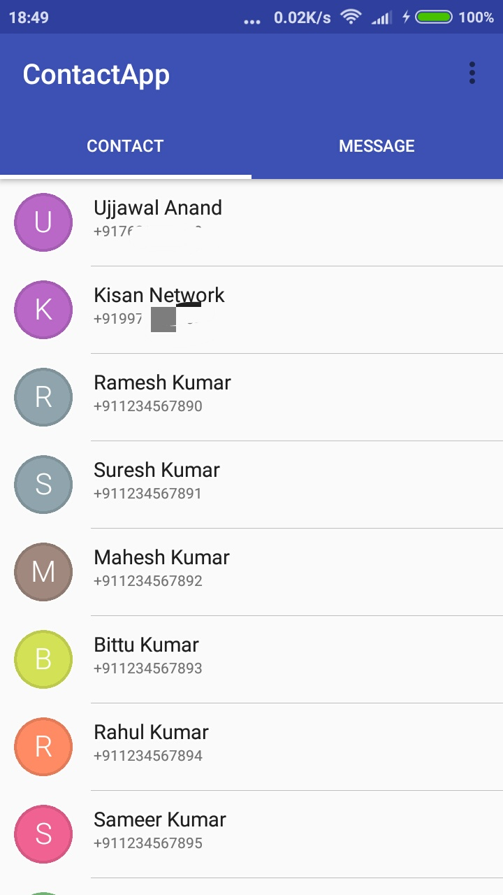
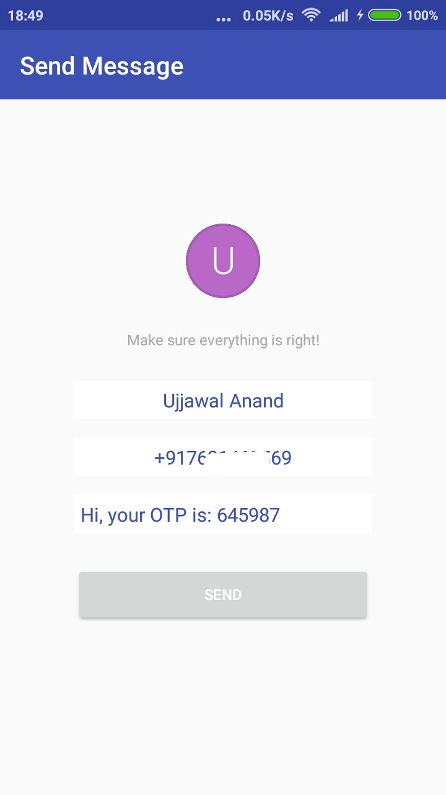
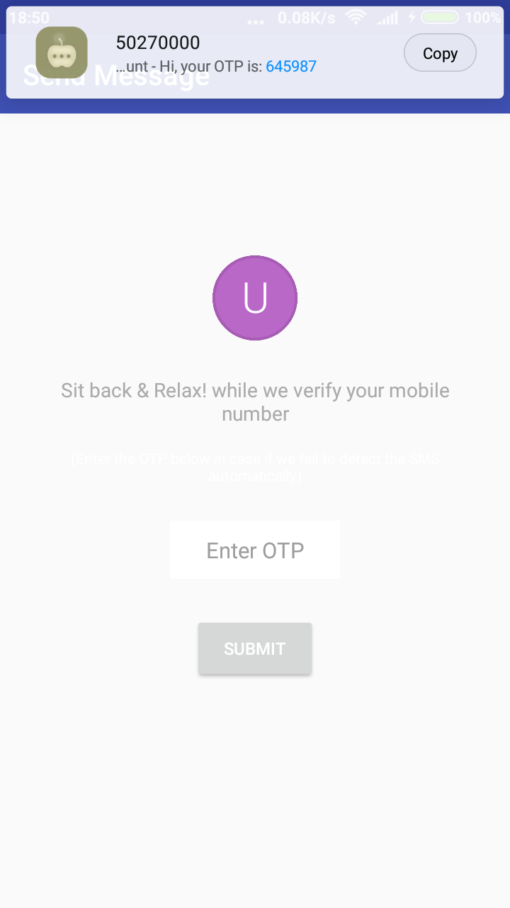
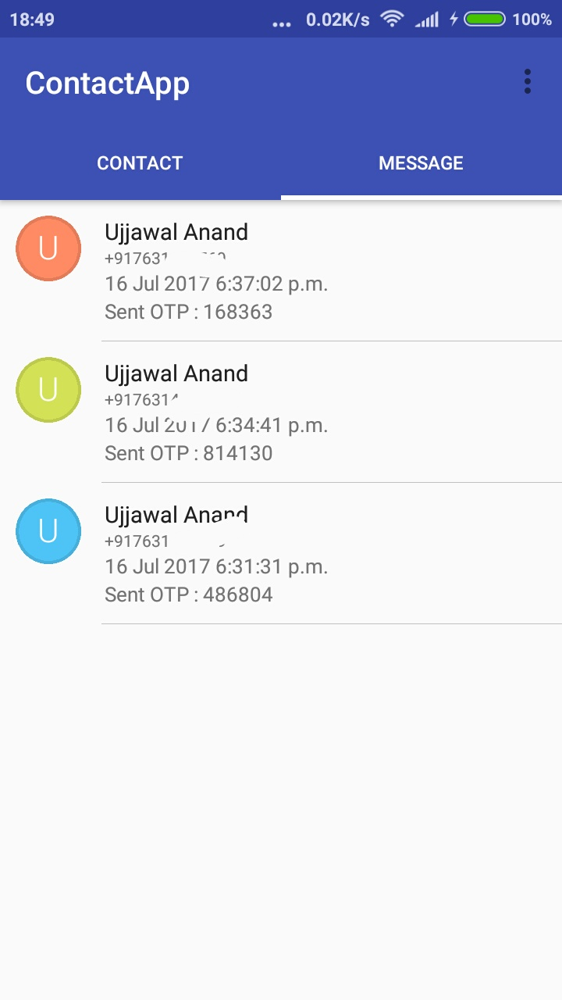

# ContactApp  

A sample app that uses twilio api to send OTP (and authenticates the same) to selected contact from the list.


 

 

## Backgound Story
I got a challenge from an Indian startup [KisanNetwork](http://kisannetwork.com) to create this app.
You can read the whole challenge [here](https://github.com/andy1729/ContactApp/blob/master/doc/challenge.pdf).
After submitting the same I put the source-code here as it will be a good example to learn for whoever is looking a solution for a similar problem.

## Install
Clone the project
```sh
git clone https://github.com/andy1729/ContactApp
```
Import it in Android studio, make sure you have all the matching dependencies.

Change contact.json file(in raw folder under res directory) to include some real contact. Current one have all the fake ones.

Get your twilio account sid and auth token from [here](https://www.twilio.com/try-twilio) and update it in SendMessageFragment.

Build the project and play ...


## Contributing

Please read [CONTRIBUTING.md](https://github.com/andy1729/ContactApp/blob/master/CONTRIBUTING.md) for details on code of conduct, and the process for submitting pull requests.


## Author

* **Ujjawal Anand** - [*andy1729*](https://andy1729.github.io)

## License

This project is licensed under the MIT License - see the [LICENSE.md](LICENSE.md) file for details

## Acknowledgments

#### Open Source Libraries Used
Third party libraries used in this project
  * [okhttp](https://github.com/square/okhttp) - to send SMS using twilio REST Api
  * [TextDrawable](https://github.com/amulyakhare/TextDrawable) to display a TextDrawable just like those in Gmail App.
